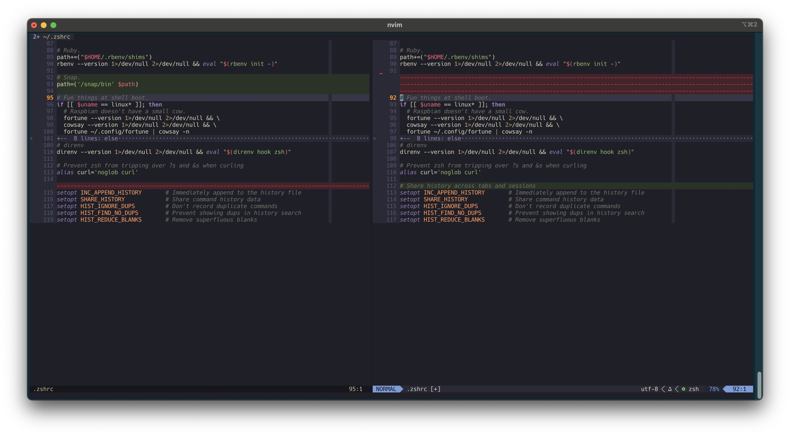

# last-look.nvim

A Neovim plugin that shows a diff any time `:q` is called with unsaved changes.



No extra steps;
this just replaces
`E37: No write since last change`
with something helpful and actionable.

From there you can choose to `:q!` or `:wq` as normal.
You can also directly edit the diff buffer and save from there.

## Install

### lazy.nvim

```lua
{ "glacials/last-look.nvim" }
```

### packer.nvim

```lua
use { "glacials/last-look.nvim" }
```

### vim-plug

```vim
Plug 'glacials/last-look.nvim'
```

### dein.vim

```vim
call dein#add('glacials/last-look.nvim')
```

### paq-nvim

```lua
require "paq" {
"glacials/last-look.nvim";
}
```

### minpac

```vim
call minpac#add('glacials/last-look.nvim')
```

## Commands

-   `:LastLook` — manually run the guard and then quit

### Inherited Commands

`last-look.nvim` does not add any actions worthy of keybinds,
but inherits the same mappings of `vimdiff`.

For your convenience:

-   `]c`: Jump to the next change
-   `[c`: Jump to the previous change
-   `zo` / `zc`: Open / close a fold
-   `zr` / `zm`: Open / close all folds
-   `do`: Bring a change into this window from the other window
-   `dc`: Take a change from this window to the other window

## License

last-look.nvim is licensed under MIT.
Please see [LICENSE](LICENSE) for details.
